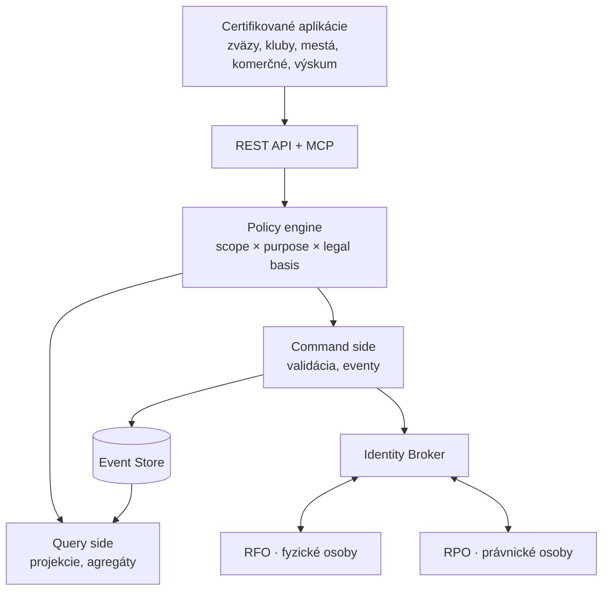

# Prehľad systému

> Čítate vstupný dokument do dokumentácie SportUp.sk. Po prečítaní by ste mali rozumieť, čo systém robí, prečo, a kam ďalej v dokumentácii zamieriť podľa svojej role.

## Čo SportUp.sk je

SportUp.sk je **centrálny informačný systém športu Slovenskej republiky**. Slúži ako:

1. **Jednotný register osôb v športe** — športovcov všetkých kategórií (profesionálnych, amatérskych, voľnočasových), trénerov, rozhodcov, delegátov, lekárov, dobrovoľníkov a ďalších osôb zapojených do športového ekosystému
2. **Register organizácií** — zväzov, klubov, miest a obcí, VÚC, štátnych orgánov, vzdelávacích inštitúcií a komerčných subjektov
3. **Katalóg športov a aktivít** — uznané aj neuznané, olympijské aj neolympijské, organizované aj neorganizované
4. **Verejný register športovísk** — slúži športu aj cestovnému ruchu
5. **API a integračná platforma** — pre certifikované aplikácie tretích strán (zväzové portály, klubové systémy, samosprávne aplikácie, komerčné platformy)

## Čo SportUp.sk **nie je**

- **Nie je portál pre koncových používateľov.** Sám neponúka UI športovcom ani klubom. Tie si stavajú aplikácie tretie strany.
- **Nie je úložisko zápasov a výsledkov.** Eviduje účasť na podujatiach, ale nie minútu po minúte.
- **Nie je sociálna sieť.** Nemá fotky, lajky, chat.
- **Nie je master pre identitu osoby.** Osobné údaje pochádzajú z RFO a RPO; SportUp si ich len cachuje.

## Hlavné architektonické rozhodnutia

| Rozhodnutie | Dôsledok |
|---|---|
| **API-first a headless** | Žiadne UI v jadre. Všetka interakcia cez REST API a MCP. |
| **Identita oddelená od role** | Person je stabilná, role sú v entite Affiliation s časovou platnosťou. |
| **Event-sourced jadro** | Stav sa odvodzuje z eventov, nie z UPDATE. História je úplná a auditovateľná. |
| **CQRS** | Zápisy idú do event store, čítania do projekcií. |
| **Granulárny consent** | Jeden súhlas = jedna kombinácia osoba × účel × prijímateľ. |
| **Zero-trust prístup** | Každé volanie cez policy engine s overením scope, consent a územnej príslušnosti. |
| **Referenčné dáta zo štátu** | RFO master pre identitu osoby, RPO pre právnické osoby. |

Detail v [`architecture/README.md`](architecture/README.md).

## Tok dát na vysokej úrovni

## Hlavné entity

| Entita | Popis | Kľúčový dokument |
|---|---|---|
| **Person** | Fyzická osoba, identita oddelená od role | [`domain/entities/person.md`](domain/entities/person.md) |
| **Affiliation** | Vzťah osoby k organizácii v role, v čase | [`domain/entities/affiliation.md`](domain/entities/affiliation.md) |
| **Organization** | Zväz, klub, mesto, škola, komerčný subjekt | [`domain/entities/organization.md`](domain/entities/organization.md) |
| **Sport / Discipline** | Šport a jeho odvetvie / disciplína | [`catalogs/sports.md`](catalogs/sports.md) |
| **Activity** | Konkrétna športová aktivita / súťaž | [`domain/entities/activity.md`](domain/entities/activity.md) |
| **Facility** | Športovisko, slúži aj cestovnému ruchu | [`domain/entities/facility.md`](domain/entities/facility.md) |
| **Qualification** | Trénerská, rozhodcovská, zdravotnícka licencia | [`domain/entities/qualification.md`](domain/entities/qualification.md) |
| **Consent** | GDPR súhlas alebo iný legal basis | [`domain/entities/consent.md`](domain/entities/consent.md) |

## Tri osi pre šport a aktivity

SportUp eviduje šport v troch nezávislých osiach. Každý šport / aktivita môže byť kombináciou hodnôt z všetkých troch:

| Os | Hodnoty | Význam |
|---|---|---|
| **Uznanie** | uznaný / neuznaný | Štátne uznanie podľa zákona o športe; uznaný šport má národný zväz |
| **Olympijská** | olympijský / neolympijský | Olympijské zastrešuje SOŠV |
| **Organizovanosť** | oficiálne organizované / neoficiálne organizované / hobby | Kto súťaž riadi |

Detaily a príklady v [`catalogs/sports.md`](catalogs/sports.md) a [`catalogs/activities.md`](catalogs/activities.md).

## Stack pre implementáciu

| Vrstva | Technológia |
|---|---|
| Frontend (admin a portál DPO) | **Next.js 15** (React Server Components) |
| Backend API | **Node.js 22** + **Hono** alebo **Fastify** |
| Doménová DB | **MongoDB 7** (event store + projekcie) |
| Cache a session | **Redis 7** |
| Policy engine | **Open Policy Agent (OPA)** |
| Authorization Server | **Keycloak** alebo **Authentik** |
| Search nad projekciami | **MeiliSearch** alebo **OpenSearch** |
| Eventy a streaming | MongoDB change streams alebo **Apache Kafka** (podľa škály) |
| Object storage | **MinIO** alebo **AWS S3** kompatibilný |
| Monitoring | **Prometheus** + **Grafana** + **Loki** |
| CI/CD | **GitHub Actions** |
| Container | **Docker** + **Kubernetes** alebo **Nomad** |

Toto sú odporúčania, nie záväzné rozhodnutia. Pred implementáciou prebehne formálne schvaľovanie cez ADR proces — viď [`architecture/decisions/`](architecture/decisions/).

## Roadmapa

Detailne v [`../ROADMAP.md`](../ROADMAP.md). Sumár:

- **Fáza 0 — Koncepčný návrh** (aktuálne) — dokumentácia, architektúra, číselníky
- **Fáza 1 — Foundation** — Identity Broker, Person, RFO/RPO integrácia, základné API
- **Fáza 2 — Domain core** — Affiliation, Organization, eventy, projekcie
- **Fáza 3 — Catalogs & Consent** — Sport, Discipline, Activity, Purpose Catalogue, policy engine
- **Fáza 4 — Facility register** — športoviská, integrácia s cestovným ruchom
- **Fáza 5 — Producer integrations** — zväzové, klubové, samosprávne aplikácie
- **Fáza 6 — Decommission existujúceho ISŠ** — postupný prechod, vypnutie starého

## Pre koho je to dôležité

| Kto | Prečo |
|---|---|
| **MCRŠ SR** | Zákonný správca, dohľad, dotačná politika |
| **Národné zväzy** | Členská báza, prestupy, licencie, súťaže |
| **Kluby** | Registrácia členov, prestupy, podujatia |
| **Mestá a obce** | Mládežnícky šport, dotácie, podpora podujatí |
| **VÚC** | Krajské programy, koordinácia, analytika |
| **Cestovný ruch (TIC, OOCR)** | Katalóg športovísk a podujatí pre návštevníkov |
| **Komerčné subjekty** | Verifikácia členstva, akreditácie, marketing |
| **Výskum a akademická obec** | Demografia, výkonnosť, zdravie športovcov |
| **Dotknuté osoby** | Pohľad na vlastné dáta, správa súhlasov |

## Ďalšie kroky podľa role

- **Pochopiť architektúru:** [`architecture/README.md`](architecture/README.md)
- **Pochopiť doménový model:** [`domain/README.md`](domain/README.md)
- **Implementovať API:** [`api/README.md`](api/README.md)
- **Spravovať číselníky:** [`catalogs/README.md`](catalogs/README.md)
- **Riešiť GDPR:** [`gdpr/README.md`](gdpr/README.md)
- **Integrácia so štátom:** [`integration/state-registers.md`](integration/state-registers.md)
- **Prevádzka:** [`operations/README.md`](operations/README.md)
