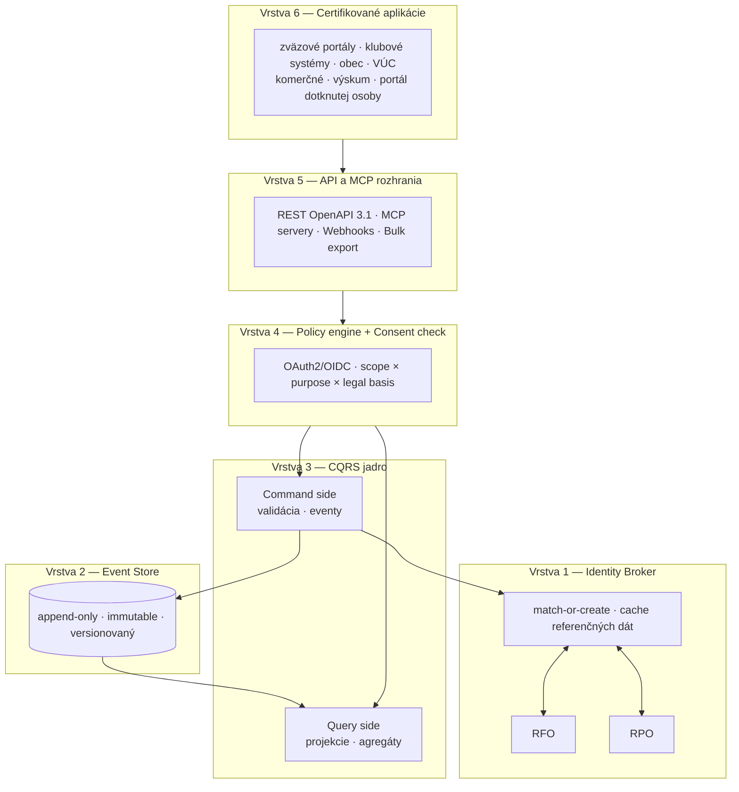

# Architektúra

Architektúra SportUp.sk vychádza z piatich princípov, ktoré sú podrobne popísané v [Architecture Decision Records](decisions/). Tento dokument poskytuje vysokoúrovňový prehľad.

## Obsah

- [Architectural overview](#architectural-overview) — vrstvy a ich zodpovednosti
- [Architecture Decision Records](decisions/) — záznamy konkrétnych rozhodnutí
- [Security model](security.md) — zero-trust prístup, autentifikácia, autorizácia
- [Event sourcing & CQRS](event-sourcing.md) — detail jadra
- [Identity Broker](identity-broker.md) — hranica so štátnymi registrami
- [Policy engine](policy-engine.md) — autorizácia a consent enforcement
- [Multi-tenancy](multi-tenancy.md) — separácia dát zväzov, klubov, samosprávy
- [Disaster recovery](disaster-recovery.md) — RPO, RTO, backup stratégia

## Architectural overview

Systém je rozdelený do šiestich logických vrstiev, každá s jednou jasnou zodpovednosťou:

## Komunikačné hranice

| Hranica | Protokol | Autentifikácia |
|---|---|---|
| Aplikácia ↔ API vrstva | HTTPS / REST + JSON | OAuth2 + mTLS |
| Aplikácia ↔ MCP server | HTTPS / SSE alebo stdio | OAuth2 + token |
| API vrstva ↔ Policy engine | gRPC alebo HTTP | mTLS interne |
| Policy engine ↔ Command side | gRPC interne | mTLS interne |
| Command side ↔ Event Store | MongoDB driver alebo Kafka | Auth heslá v secret store |
| Identity Broker ↔ ÚPVS | SOAP alebo REST cez ÚPVS | Klientský certifikát štátu |
| Webhooks SportUp ↔ klient | HTTPS POST | HMAC podpis + retry |

## Deployment model

Cieľová cloud-native deploy:

- **Kubernetes** alebo **Nomad** orchestrácia
- **Multi-AZ** v rámci EÚ (primárne SR, fallback EU-Central)
- **Database**: MongoDB Atlas alebo on-premise replikový set
- **Redis Sentinel** pre HA cache
- **OPA** ako sidecar v každom pode API vrstvy
- **Ingress**: Cloudflare alebo NLB s WAF

Detaily v [`../operations/deployment.md`](../operations/deployment.md).

## Non-functional requirements

| Atribút | Cieľ |
|---|---|
| Dostupnosť (čítanie) | 99.9 % |
| Dostupnosť (zápis) | 99.5 % |
| Latencia p50 (verifikačné volania) | < 50 ms |
| Latencia p95 (štandardné dotazy) | < 200 ms |
| Latencia p95 (štatistiky) | < 2 s |
| RPO (Recovery Point Objective) | < 5 min |
| RTO (Recovery Time Objective) | < 2 h |
| Audit retention | 10 rokov |
| Data residency | EÚ (primárne SR) |

## Ďalšie čítanie

- [`event-sourcing.md`](event-sourcing.md) — detail event sourcing pattern
- [`security.md`](security.md) — zero-trust a šifrovanie
- [`identity-broker.md`](identity-broker.md) — integrácia so štátom
- [`decisions/`](decisions/) — konkrétne rozhodnutia (ADR)
