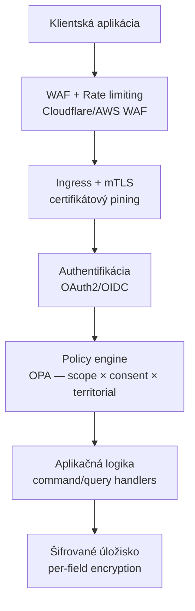

# Bezpečnosť a Zero-Trust model

> Bezpečnostná architektúra SportUp.sk vychádza z **zero-trust** princípu — neexistuje žiadna implicitná dôvera, žiaden "interný" segment siete s privilegovaným prístupom.

## Princípy

1. **Nedôverujeme ničomu** — každé volanie je autentifikované, autorizované a auditované
2. **Defense in depth** — viacero vrstiev nezávislých kontrol
3. **Least privilege** — aplikácia, používateľ, service má len také práva, aké minimálne potrebuje
4. **Žiadne tajomstvá v kóde** — secrets v dedikovanom store (HashiCorp Vault alebo cloud KMS)
5. **Šifrovanie dát v pokoji aj v tranzite** — TLS 1.3 minimum, AES-256 pre at-rest
6. **Audit log nedeleteable** — append-only, samostatná retencia 10 rokov
7. **Citlivé polia šifrované per-field** — nielen disk encryption

## Vrstvy obrany



## Autentifikácia

### Pre certifikované aplikácie

**OAuth2 Client Credentials** (server-to-server):

- Aplikácia má `client_id` a `client_secret` (alebo lepšie: klientský certifikát)
- Pri každom volaní si vyzdvihne access token
- Token je krátkodobý (1 hodina), refresh nie je
- Pre vyšší trust level: **mTLS** s klientským certifikátom

### Pre používateľov v týchto aplikáciách

**OAuth2 Authorization Code + PKCE**, alebo lepšie **eID**:

- Aplikácia presmeruje na SportUp Authorization Server
- Používateľ sa prihlási cez eID alebo iný IdP
- Vráti sa s authorization code → token exchange
- Token má scope-y vyplývajúce z používateľovej role

## Autorizácia

### Scope-based access

Každý token má zoznam scope-ov, napr.:

```
affiliations:read:own_organization
affiliations:write:own_organization
qualifications:read:public
statistics:aggregate:any
```

### Policy engine (OPA)

Aj keď token má scope, policy engine ešte overuje:

1. **Existencia consent / legal basis** pre konkrétny purpose
2. **Versional kompatibilita** — consent na verzii 1.0 účelu, ktorý je teraz v 2.0?
3. **Územná príslušnosť** — môže obec Bratislava upravovať dáta hráča v Prešove?
4. **Časová platnosť** — operácia v rámci platnosti afiliácie aplikácie
5. **Stav agregátu** — nemôže ukončiť už terminated afiliáciu

Policy je deklaratívna v Rego jazyku, verzionovaná v gite, testovateľná.

## Šifrovanie

### V tranzite

- **TLS 1.3** minimum medzi klientmi a SportUp
- **mTLS** vnútri (pod-to-pod, k ÚPVS)
- **Certificate pinning** pre kľúčové tokeny

### V pokoji

- **Disk encryption** na úrovni node-ov (LUKS, AWS EBS encryption)
- **Database encryption at rest** (MongoDB encryption)
- **Per-field encryption** pre osobitne citlivé:
  - `national_id_encrypted` — rodné číslo (KMS-managed)
  - `rfo_identifier` — IFO
  - `health_records.*` — zdravotné údaje
  - `disciplinary_data` — disciplinárne info

KMS:
- Cloud KMS (AWS, GCP) alebo HashiCorp Vault
- Kľúče sa rotujú ročne
- Audit každého použitia

## Audit log

### Čo sa loguje

Každé API volanie:

```json
{
  "audit_id": "...",
  "occurred_at": "2026-04-30T10:00:00Z",
  "request_id": "req-...",
  "actor": {
    "app_id": "...",
    "user_id": "...",
    "ip": "...",
    "user_agent": "..."
  },
  "operation": {
    "method": "POST",
    "endpoint": "/v1/affiliations",
    "purpose_code": "REG-SPORTOVEC-001"
  },
  "target": {
    "person_id": "...",
    "organization_id": "..."
  },
  "result": {
    "status_code": 201,
    "policy_decision": "allow"
  },
  "consent_used": {
    "consent_id": "...",
    "purpose_version": "1.0"
  }
}
```

### Storage

- Samostatná collection / index, oddelená od aplikačných dát
- **Append-only** — žiaden update/delete v rámci aplikácie
- **Cold storage** po 90 dňoch, hot search 90 dní
- Retencia **10 rokov** podľa zákona o IS verejnej správy
- Pravidelný export do nemodifikovateľného storage (S3 Object Lock)

### Na čo sa pozerá

- DPO dashboard — kto pristúpil k dátam osoby
- Anomaly detection — neštandardný vzor (napr. aplikácia volá 1000× za minútu)
- Forensics — pri incidente

## Rate limiting a abuse prevention

| Limit | Hodnota |
|---|---|
| Auth attempts / IP / hodina | 60 |
| API calls / token / minúta | 600 |
| API calls / token / deň | 100 000 |
| Bulk export / aplikácia / deň | 1 |
| Verifikačné volania / aplikácia / deň | 10 000 |

Rate limit-y sú konfigurovateľné per-aplikácia podľa zmluvy.

## Bezpečnosť pre maloletých

- **Verifikácia veku** v Person → automatická detekcia maloletého
- **Súhlasy zákonných zástupcov** povinné pre väčšinu purpose-ov
- **MKT-FOTO-001-MALOLETY** — fotografie maloletého majú osobitný strict purpose
- **Policy engine vie**, že target je maloletý a aplikuje prísnejšie pravidlá
- **Žiadne komerčné overenie** maloletých pre KOM-* purposes

## Odpoveď na incident

Pozri [`SECURITY.md`](../../SECURITY.md) v rote repa pre proces hlásenia.

Pri incidente:

1. **Detekcia** — anomaly detection, monitoring, hlásenie
2. **Containment** — izolácia komponentu, revoke kompromitovaných tokenov
3. **Eradication** — fix zraniteľnosti, rotácia secret-ov
4. **Recovery** — návrat do prevádzky
5. **Lessons learned** — post-mortem, ADR pre zmenu

Pri **breach** osobných údajov:

- Notifikácia ÚOOÚ do 72 hodín (čl. 33 GDPR)
- Notifikácia dotknutých osôb (čl. 34 GDPR)
- Public disclosure podľa SECURITY.md timeline

## Compliance

| Rámec | Splnenie |
|---|---|
| GDPR | Architektúra, Purpose Catalogue, Consent management |
| Zákon č. 18/2018 | Adekvátne organizačné a technické opatrenia |
| Zákon č. 305/2013 (eGov) | Audit log, integrácia ÚPVS, accessibilité |
| ISO 27001 | Cieľ pre nasadenie (po fáze 3) |
| WCAG 2.1 AA | Pre všetky web rozhrania |

## Referencie

- ADR-0003 — Granulárny consent
- [`policy-engine.md`](policy-engine.md) — implementačný detail OPA
- [`../gdpr/README.md`](../gdpr/README.md)
- [`../../SECURITY.md`](../../SECURITY.md) — disclosure proces
