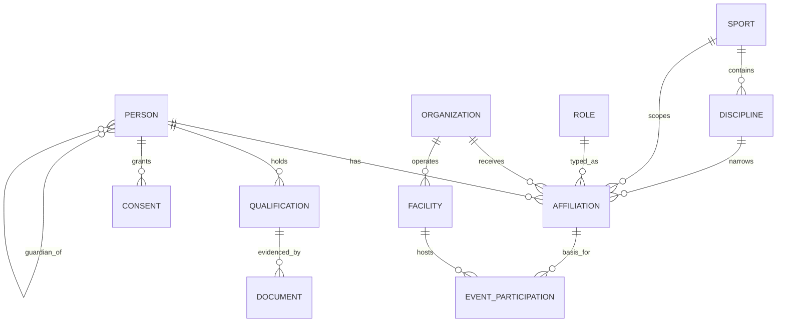

# Doménový model

Tento adresár obsahuje detailný popis doménového modelu SportUp.sk — entity, ich atribúty, vzťahy, životný cyklus a eventy.

## Štruktúra

```
domain/
├── README.md             ← ste tu
├── overview.md           ← ER diagram, vzťahy, princípy
├── entities/             ← detail každej entity
│   ├── person.md
│   ├── affiliation.md
│   ├── organization.md
│   ├── activity.md
│   ├── facility.md
│   ├── qualification.md
│   ├── consent.md
│   ├── document.md
│   └── event-participation.md
├── events/               ← katalóg eventov
│   ├── README.md
│   ├── affiliation-events.md
│   ├── consent-events.md
│   ├── qualification-events.md
│   └── person-events.md
└── value-objects/        ← reusable value objekty
    ├── address.md
    ├── period.md
    └── identification.md
```

## Princípy

### 1. Identita oddelená od role

Person je stabilná entita. Atribúty Person sú výhradne tie, ktoré opisujú osobu ako ľudskú bytosť (meno, dátum narodenia, kontakty). **Žiadne športové polia** v Person tabuľke — žiadne `current_club_id`, žiadne `is_referee`, žiadne `coach_license_level`.

Všetko športové je v entitách Affiliation, Qualification, EventParticipation.

### 2. Časová dimenzia je vstavaná

Každý vzťah, ktorý môže meniť stav v čase, má atribúty `valid_from` a `valid_to`. Aktuálnosť sa odvodzuje, nie ukladá.

### 3. Eventovanie najdôležitejších agregátov

Affiliation, Consent a Qualification sú modelované cez event sourcing (pozri ADR-0001). Person, Organization, Sport, Discipline, Facility sú klasické CRUD entity s history tabuľkami.

### 4. Referenčné dáta zo štátu

Person referenčne odkazuje na RFO (cez `rfo_identifier`). Organization odkazuje na RPO (cez `ico` a `rpo_identifier`). Lokálne kópie atribútov sú cache, nie master.

### 5. Stabilné UUID kľúče

Všetky entity majú UUID primárny kľúč. Žiadne meaningful keys (napr. rodné číslo ako PK).

## Hlavné entity

| Entita | Eventovaná? | Master register | Kľúčový dokument |
|---|:---:|---|---|
| **Person** | čiastočne | RFO | [`entities/person.md`](entities/person.md) |
| **Organization** | čiastočne | RPO | [`entities/organization.md`](entities/organization.md) |
| **Affiliation** | ✓ | SportUp | [`entities/affiliation.md`](entities/affiliation.md) |
| **Activity** | čiastočne | SportUp | [`entities/activity.md`](entities/activity.md) |
| **Facility** | ✗ | SportUp | [`entities/facility.md`](entities/facility.md) |
| **Qualification** | ✓ | SportUp | [`entities/qualification.md`](entities/qualification.md) |
| **Consent** | ✓ | SportUp | [`entities/consent.md`](entities/consent.md) |
| **Document** | ✗ | SportUp | [`entities/document.md`](entities/document.md) |
| **EventParticipation** | ✗ | SportUp | [`entities/event-participation.md`](entities/event-participation.md) |

## ER diagram

Detail v [`overview.md`](overview.md). V skratke:


