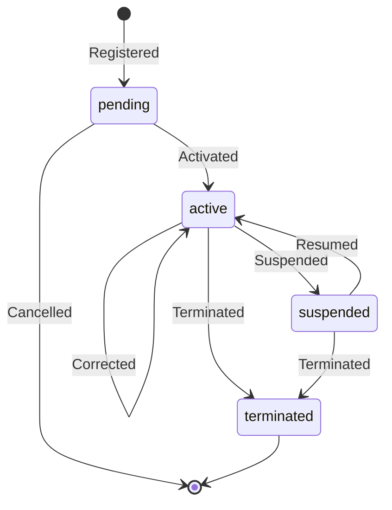

# Entity: Affiliation

> Srdce systému. Vzťah osoby k organizácii v určitej role, v určitom športe, v určitom čase.

## Účel

Affiliation modeluje **konkrétnu rolu konkrétnej osoby v konkrétnej organizácii v konkrétnom športe**. Je to najdôležitejšia entita celého SportUp.sk — takmer všetky operácie sa tak či onak dotýkajú afiliácií.

Príklady:

- Mária je amatérska športovkyňa (rola) v ŠK Slovan Bratislava (organizácia) vo futbale (šport) → Affiliation A
- Mária je súčasne tréner mládeže (rola) v ZŠ Krásnohorská (organizácia) v atletike (šport) → Affiliation B
- Mária je dobrovoľníčkou (rola) na Bratislavskom maratóne (organizácia) → Affiliation C

Tri afiliácie, jedna osoba.

## Master register

**SportUp je master.** Žiadny iný systém neudržiava autoritatívnu evidenciu o tom, kto kde aké rolu vykonáva. Národné zväzy, kluby, mestá pristupujú k svojim afiliáciám cez API.

## Eventovaná

Affiliation je **plne eventovaná** podľa ADR-0001. Aktuálny stav sa odvodzuje zo sekvencie eventov, nie ukladá ako snapshot. Pozri [`../events/affiliation-events.md`](../events/affiliation-events.md).

## Schéma

| Pole | Typ | Popis |
|---|---|---|
| `affiliation_id` | UUID | Primárny kľúč |
| `person_id` | UUID FK | → Person |
| `organization_id` | UUID FK | → Organization |
| `role_code` | String FK | Z číselníka rolí (activity-types) |
| `sport_code` | String FK | Z číselníka športov |
| `discipline_code` | String FK \| null | Z číselníka disciplín (ak je relevantné) |
| `category_code` | String FK \| null | Z číselníka kategórií (vekové/výkonnostné) |
| `valid_from` | Date | Začiatok platnosti |
| `valid_to` | Date \| null | Koniec (null = otvorený) |
| `status` | Enum | `pending` / `active` / `suspended` / `terminated` |
| `legal_title_code` | String FK | Z číselníka právnych titulov |
| `registration_number` | String \| null | Interné ID pridelené organizáciou |
| `source_app_id` | UUID | Ktorá certifikovaná aplikácia vytvorila/zmenila |
| `created_at` | Timestamp | |
| `updated_at` | Timestamp | |

### Computed fields (v projekciách)

| Pole | Výpočet |
|---|---|
| `is_currently_active` | `status = 'active' AND valid_from ≤ now() ≤ COALESCE(valid_to, ∞)` |
| `tenure_days` | Počet dní medzi `valid_from` a aktuálnym alebo `valid_to` |
| `position_in_history` | Číslo v poradí afiliácií osoby |

## Constraints

- Osoba **nemôže mať dve aktívne afiliácie** s tým istým `(role_code, organization_id, sport_code, discipline_code)` súčasne. Vyžaduje sa cez aplikačnú logiku v command handler-i.
- `valid_to >= valid_from` (ak je nastavené).
- Zmena `organization_id` cez UPDATE je **zakázaná**. Prestup sa modeluje cez sagu (ADR-0002).

## Príklad

```json
{
  "affiliation_id": "a3f8b9d0-1234-5678-90ab-cdef01234567",
  "person_id": "550e8400-e29b-41d4-a716-446655440000",
  "organization_id": "7c3a9f1e-...",
  "role_code": "amatersky_sportovec",
  "sport_code": "SK-FTB",
  "discipline_code": "SK-FTB-FUTSAL",
  "category_code": "SK-FTB-WOMEN",
  "valid_from": "2024-08-01",
  "valid_to": null,
  "status": "active",
  "legal_title_code": "registracia_clen",
  "registration_number": "SFZ-2024-12345",
  "source_app_id": "app-sfz-portal",
  "created_at": "2024-08-01T09:30:00Z",
  "updated_at": "2024-08-01T09:30:00Z"
}
```

## Životný cyklus



Detail eventov v [`../events/affiliation-events.md`](../events/affiliation-events.md).

## Špeciálne flow-y

### Prestup ako saga

Prestup hráča z klubu A do klubu B sa modeluje ako saga (ADR-0002):

1. `TransferRequested` na process agregát
2. `AffiliationTerminated` na pôvodnej afiliácii (klub A) s `reason = transfer`
3. `AffiliationRegistered` + `AffiliationActivated` na novej afiliácii (klub B)
4. `TransferCompleted` na process agregát

Všetky eventy zdieľajú `correlation_id`. Detaily v [`../../scenarios/02-player-transfer.md`](../../scenarios/02-player-transfer.md).

### Zmena role v rámci tej istej organizácie

Hráč → asistent trénera v tom istom klube? Dve možnosti:

- **`AffiliationRoleChanged`** — udržiava jednu afiliáciu, len mení rolu. Použiť, ak je to v podstate kontinuálny vzťah.
- **`AffiliationTerminated` + nová `AffiliationRegistered`** — ukončenie starej, nová s novou rolou. Použiť, ak je to skôr "pôvodná kariéra ukončená, nová začala".

Rozhodnutie je biznis — dohodne sa s príslušným zväzom.

### Ukončenie kvôli úmrtiu

Po notifikácii z RFO (Person `date_of_death` nastavený):
1. Trigger generuje `AffiliationTerminated` event s `reason = death` pre všetky aktívne afiliácie osoby
2. Status afiliácií prechádza do `terminated`
3. Historické dáta zostávajú nedotknuté

## Projekcie nad Affiliation

Najpoužívanejšie:

| Projekcia | Účel |
|---|---|
| `current_affiliations` | Aktuálne aktívne afiliácie pre rýchle dotazy |
| `person_timeline` | Všetky afiliácie jednej osoby v čase |
| `organization_roster` | Členovia organizácie k dátumu |
| `transfer_log` | Všetky prestupy s `correlation_id` |
| `referee_assignments` | Aktuálne afiliácie rozhodcov pre delegácie |
| `coach_directory` | Tréneri po športoch a kategóriách |
| `volunteer_pool` | Dobrovoľníci ponuk dostupní pre podujatia |

Detail v [`../../api/projections.md`](../../api/projections.md).

## API endpoints (preview)

```
GET    /v1/affiliations/{affiliation_id}
POST   /v1/affiliations
PATCH  /v1/affiliations/{affiliation_id}
DELETE /v1/affiliations/{affiliation_id}     ← terminate, neziadná tvrdá deletácia
POST   /v1/affiliations/{affiliation_id}/suspend
POST   /v1/affiliations/{affiliation_id}/resume
POST   /v1/transfers                         ← spustí sagu
GET    /v1/persons/{person_id}/affiliations
GET    /v1/organizations/{org_id}/affiliations
```

Detail v [`../../api/endpoints/affiliations.md`](../../api/endpoints/affiliations.md).

## Referencie

- ADR-0001 — Event sourcing
- ADR-0002 — Saga pattern pre prestupy
- [`person.md`](person.md) — vzťah z osoby
- [`organization.md`](organization.md) — vzťah z organizácie
- [`../events/affiliation-events.md`](../events/affiliation-events.md) — kompletný katalóg eventov
- [`../../catalogs/activity-types.md`](../../catalogs/activity-types.md) — číselník rolí
