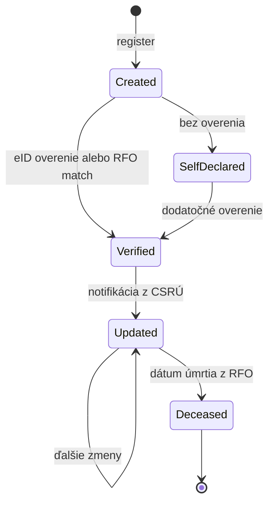

# Entity: Person

> Fyzická osoba v systéme. Stabilná entita s identitou oddelenou od role.

## Účel

Person opisuje človeka ako ľudskú bytosť. Eviduje **identitu**, **demografiu** a **kontaktné údaje**, NIE jeho rolu v športe (športovec, tréner, rozhodca…). Všetky športové vzťahy sú v entite [Affiliation](affiliation.md).

Tento princíp je kritický pre celý systém. Keby sme mali napríklad `coach_license_level` priamo v Person, človek, ktorý je v jednom športe trénerom a v druhom rozhodcom, by mal nekonzistentný záznam.

## Master register

**RFO (Register fyzických osôb)** je master pre identitu fyzickej osoby v SR. SportUp:

- udržiava **lokálnu cache** atribútov (meno, dátum narodenia, štátna príslušnosť, adresa)
- pri prvej registrácii sa pokúsi o **match-or-create** voči RFO cez Identity Broker
- spracúva **zmenové notifikácie** z CSRÚ (ÚPVS) a aktualizuje cache
- **automaticky reaguje** na úmrtie z RFO (ukončí aktívne afiliácie eventom)

Pre cudzincov (bez záznamu v RFO) si SportUp vytvára vlastný neverifikovaný záznam s `verification_status = unverified` alebo `self_declared`.

## Schéma

### Povinné jadro (core identity)

| Pole | Typ | Popis |
|---|---|---|
| `person_id` | UUID | Primárny kľúč. Nemenný, interný. |
| `given_name` | String | Krstné meno |
| `family_name` | String | Priezvisko |
| `additional_names` | Array<String> | Stredné mená, prípadne staré priezviská |
| `date_of_birth` | Date | Dátum narodenia |
| `gender` | Enum | `male` / `female` / `other` / `undisclosed` |
| `nationality` | ISO 3166 | Štátna príslušnosť (kód krajiny) |
| `verification_status` | Enum | `unverified` / `self_declared` / `verified_by_organization` / `verified_by_eid` / `verified_by_rfo` |
| `date_of_death` | Date \| null | Notifikované z RFO |
| `is_minor` | Boolean | Derivované z `date_of_birth` |
| `created_at` | Timestamp | Čas vzniku záznamu v SportUp |
| `updated_at` | Timestamp | Čas poslednej úpravy |

### Identifikátory (citlivé, samostatný scope)

| Pole | Typ | Popis |
|---|---|---|
| `rfo_identifier` | String, encrypted | IFO z RFO (po overení) |
| `national_id_hash` | Hash | SHA-256 hash rodného čísla pre deduplikáciu |
| `national_id_encrypted` | Encrypted blob | Rodné číslo zašifrované; dešifrované len pri komunikácii s RFO |
| `foreign_id_type` | Enum \| null | `passport` / `residence_permit` (pre cudzincov) |
| `foreign_id_value` | String, encrypted, null | Hodnota zahraničného identifikátora |
| `foreign_id_country` | ISO 3166 | Krajina vydania |

### Rozšírená demografia (samostatný scope)

| Pole | Typ | Popis |
|---|---|---|
| `email` | String | Primárny kontakt |
| `phone` | String | E.164 formát |
| `address` | Object | Štruktúrovaná adresa, cache z RFO |
| `language` | ISO 639 | Preferovaný jazyk komunikácie (`sk`, `en`, `hu`…) |
| `photo_id` | UUID | Odkaz na Document s fotografiou |
| `emergency_contacts` | Array<Object> | Núdzové kontakty pre súťaže |
| `notification_prefs` | Object | Preferencie pre e-mail / SMS notifikácie |

### Vzťahy

| Vzťah | Popis |
|---|---|
| `affiliations` | One-to-many → Affiliation |
| `qualifications` | One-to-many → Qualification |
| `consents` | One-to-many → Consent |
| `legal_guardians` | Many-to-many → Person (pre maloletých) |
| `wards` | Many-to-many → Person (zverené osoby) |
| `documents` | One-to-many → Document |

## Príklad

```json
{
  "person_id": "550e8400-e29b-41d4-a716-446655440000",
  "given_name": "Mária",
  "family_name": "Nováková",
  "additional_names": [],
  "date_of_birth": "1992-03-15",
  "gender": "female",
  "nationality": "SK",
  "verification_status": "verified_by_eid",
  "is_minor": false,

  "rfo_identifier": "ENC:abc...",
  "national_id_hash": "sha256:7a8b...",
  "national_id_encrypted": "ENC:xyz...",

  "email": "maria.novakova@example.sk",
  "phone": "+421901234567",
  "address": {
    "street": "Hlavná 12",
    "city": "Bratislava",
    "postal_code": "81101",
    "country": "SK"
  },
  "language": "sk",

  "created_at": "2026-04-15T10:00:00Z",
  "updated_at": "2026-04-15T10:00:00Z"
}
```

## Životný cyklus



## Edge cases

### Maloletí

Osoba s `is_minor = true` (derivované z `date_of_birth`):

- Vyžaduje záznamy `legal_guardians` (Many-to-many → Person)
- Súhlasy udeľuje zákonný zástupca, nie sama
- Pri dovŕšení 18 rokov systém vygeneruje notifikáciu na opätovné potvrdenie súhlasov
- Niektoré účely (napr. marketingové fotky) majú samostatné `_MINOR` varianty s prísnejšími pravidlami

### Cudzinci

Bez RFO záznamu:

- `rfo_identifier = null`
- `verification_status` typicky `self_declared` alebo `verified_by_organization`
- Identifikátor cez `foreign_id_type` + `foreign_id_value` + `foreign_id_country`
- Deduplikácia cez fuzzy match (meno + dátum narodenia + krajina + identifikátor)

### Zmeny mena

História mien je samostatná entita `PERSON_NAME_HISTORY` s časovou platnosťou:

```
person_name_history
  history_id, person_id, given_name, family_name,
  valid_from, valid_to, reason (marriage|legal|gender|other)
```

### Úmrtie

Notifikácia z CSRÚ → nastavenie `date_of_death` → trigger:

1. `PersonDeceased` event
2. Automatická produkcia `AffiliationTerminated` eventov pre všetky aktívne afiliácie s `reason = death`
3. Citlivé údaje sa archivujú (nesmú sa mazať — historická hodnota), ale prístup je obmedzený
4. Niektoré projekcie sa prepočítavajú (napr. odstránenie zo živých členských zoznamov)

### Duplicitné identity

Identity Resolution servis cez:
1. Fuzzy match na meno + dátum narodenia
2. Manuálny review, ak skóre v intervale 0.7–0.95
3. Automatický merge cez `PersonsMerged` event s odkazom na obidve pôvodné `person_id`
4. Stará referencia ostáva platná, redirect na nový primárny

## API endpoints (preview)

Detail v [`../../api/endpoints/persons.md`](../../api/endpoints/persons.md):

```
GET    /v1/persons/{person_id}
POST   /v1/persons
PATCH  /v1/persons/{person_id}
GET    /v1/persons/{person_id}/affiliations
GET    /v1/persons/{person_id}/qualifications
GET    /v1/persons/{person_id}/consents
POST   /v1/persons/{person_id}/verify-with-rfo
POST   /v1/persons/merge
```

## Referencie

- ADR-0001 — Event sourcing (Person je čiastočne eventovaná — len verifikácie)
- [`affiliation.md`](affiliation.md) — vzťah cez Affiliation
- [`../../integration/state-registers.md`](../../integration/state-registers.md) — RFO integrácia
- [`../../gdpr/data-classification.md`](../../gdpr/data-classification.md) — citlivosť polí
