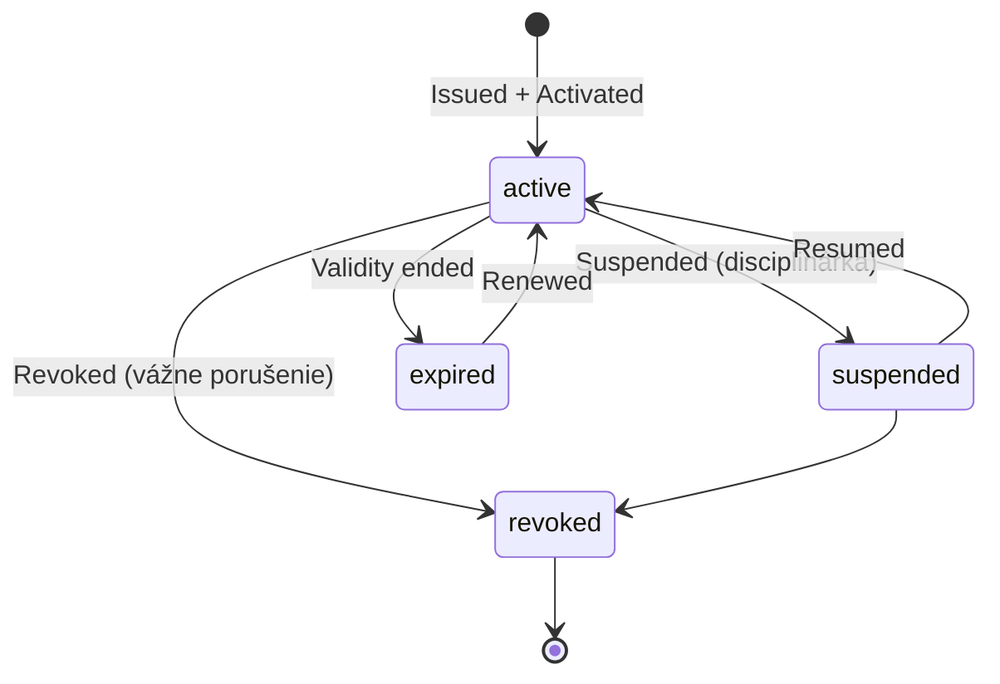

# Entity: Qualification

> Licencia, certifikát alebo kvalifikácia osoby. Trénerská, rozhodcovská, zdravotnícka, organizačná.

## Účel

Qualification eviduje **nadobudnuté vzdelanie a oprávnenia** osoby pre vykonávanie športových rolí. Príklady:

- UEFA Pro licencia trénera
- FIDE arbiter (rozhodca šachu)
- Atestácia športového lekára
- Certifikát Safeguarding (ochrana detí v športe)
- Rozhodcovská licencia 1. stupňa

## Kľúčový princíp: kvalifikácia patrí osobe, nie afiliácii

Tréner s licenciou UEFA B si licenciu nesie so sebou, **aj keď zmení klub**. Kvalifikácia je v entite Person, nie viazaná na konkrétnu Affiliation.

Oprávnenie trénovať konkrétny tím je však **kombináciou troch vecí**:

```
oprávnenie = aktívna Person + aktívna Qualification + aktívna Affiliation ako tréner
```

Policy engine to overuje pri každom volaní, ktoré takéto oprávnenie vyžaduje.

## Eventovaná

Qualification je plne eventovaná. Eventy: `QualificationIssued`, `QualificationActivated`, `QualificationSuspended`, `QualificationExpired`, `QualificationRevoked`, `QualificationRenewed`.

## Schéma

| Pole | Typ | Popis |
|---|---|---|
| `qualification_id` | UUID | Primárny kľúč |
| `person_id` | UUID FK | → Person |
| `qualification_type` | String FK | Z číselníka kvalifikácií |
| `level` | String \| null | Stupeň (Pro, A, B, C…) |
| `issuing_organization_id` | UUID FK | Kto vydal |
| `issued_at` | Date | Dátum vydania |
| `valid_from` | Date | Začiatok platnosti |
| `valid_to` | Date \| null | Koniec platnosti |
| `status` | Enum | `active` / `expired` / `suspended` / `revoked` |
| `document_id` | UUID FK \| null | Scan dokladu |
| `external_id` | String \| null | Identifikátor v externom systéme (napr. UEFA ID) |
| `cpd_hours_completed` | Number | Absolvované hodiny CPD |
| `cpd_hours_required` | Number | Povinné CPD pre obnovu |
| `next_renewal_date` | Date \| null | Kedy sa musí obnoviť |

## Príklad

```json
{
  "qualification_id": "q1234567-...",
  "person_id": "550e8400-...",
  "qualification_type": "coach_uefa_b",
  "level": "B",
  "issuing_organization_id": "uefa-uuid",
  "issued_at": "2022-06-15",
  "valid_from": "2022-06-15",
  "valid_to": "2027-06-15",
  "status": "active",
  "document_id": "doc-...",
  "external_id": "UEFA-LIC-12345",
  "cpd_hours_completed": 24,
  "cpd_hours_required": 30,
  "next_renewal_date": "2027-06-15"
}
```

## Životný cyklus



## CPD (Continuous Professional Development)

Mnohé licencie vyžadujú **kontinuálne vzdelávanie** pre obnovenie. SportUp eviduje:

- `cpd_hours_completed` — koľko osoba absolvovala
- `cpd_hours_required` — koľko potrebuje pre obnovenie
- Cez `KVL-CPD-001` purpose sa eviduje aj aké kurzy

Notifikácie: 6 mesiacov pred expiráciou systém vygeneruje upozornenie pre osobu a jej hlavnú afiliáciu.

## Medzinárodné kvalifikácie

Cez `external_id` a `KVL-MEDZINARODNE-001` purpose sa prepájame s medzinárodnými systémami:

- UEFA Coaching License Database
- FIDE Arbiter database
- FIS coaches registry
- Medzinárodné rozhodcovské zoznamy

## Referencie

- [`../../catalogs/qualifications.md`](../../catalogs/qualifications.md) — typy kvalifikácií
- [`../../gdpr/purpose-catalogue.md`](../../gdpr/purpose-catalogue.md) — KVL účely
- [`../events/qualification-events.md`](../events/qualification-events.md)
