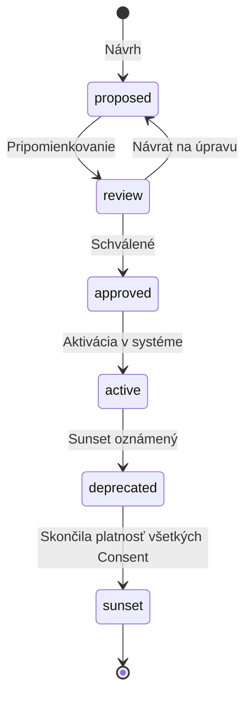

# Purpose Catalogue — kompletná špecifikácia

> Centrálny verzionovaný register všetkých účelov spracovania osobných údajov v slovenskom športe a cestovnom ruchu.

## Vrstvený model

```
Vrstva 0 — Univerzálne (~50 účelov)
  └── Vrstva 1 — Kategóriové (~15-20 účelov)
        └── Vrstva 2 — Špecifické pre šport/zväz/rezort (~40-60)
              └── Vrstva 3 — Disciplinárne (jednotky)
```

Realný počet aktívnych účelov: **110-130**.

## Schéma účelu (YAML zdroj)

```yaml
- purpose_code: REG-SPORTOVEC-001
  version: "1.0"
  inheritance_level: 0  # 0 univerzálny / 1 kategóriový / 2 špecifický / 3 disciplinárny
  applicable_scope:
    sports: all              # alebo zoznam kódov: ["SK-FTB", "SK-HKJ"]
    disciplines: all
    roles: ["amatersky_sportovec", "profesionalny_sportovec"]
    org_types: ["sportovy_klub", "narodny_zvaz"]

  label_sk: "Registrácia športovca v zväze a klube"
  label_en: "Athlete registration in federation and club"
  description_sk: |
    Spracovanie osobných údajov športovca na účely evidencie
    v centrálnom registri SportUp, jeho materskom klube
    a príslušnom národnom zväze, vrátane vystavenia
    registračného preukazu a účasti na súťažiach.

  legal_basis: ["contract", "public_task"]
  legal_reference: "§ 79 zákona č. 440/2015 Z.z. o športe"

  required_data_scopes: ["core_identity", "contact", "photo"]
  optional_data_scopes: ["emergency_contact"]

  special_category: none  # none | health | biometric | criminal

  withdrawal_allowed: false
  retention_period_days: 1825
  retention_trigger: "affiliation_termination"

  processor_role: "joint_controller"
  applies_to_minors: "with_guardian_consent"  # rules | with_guardian_consent | no
  transfer_to_third_country: false
  automated_decision_making: false

  status: active
  valid_from: "2026-09-01"
```

## Jedenásť kategórií

| Prefix | Kategória | Počet | Detail |
|---|---|---|---|
| `REG-*` | Identita a registrácia | ~14 | [`purposes/REG-identity.md`](purposes/REG-identity.md) |
| `KVL-*` | Kvalifikácie a licencie | ~7 | [`purposes/KVL-qualifications.md`](purposes/KVL-qualifications.md) |
| `POD-*` | Súťaže a podujatia | ~8 | [`purposes/POD-competitions.md`](purposes/POD-competitions.md) |
| `ZDR-*` | Zdravie a bezpečnosť | ~7 | [`purposes/ZDR-health.md`](purposes/ZDR-health.md) |
| `FIN-*` | Finančné a administratívne | ~7 | [`purposes/FIN-financial.md`](purposes/FIN-financial.md) |
| `DIS-*` | Disciplinárne a regulačné | ~5 | [`purposes/DIS-disciplinary.md`](purposes/DIS-disciplinary.md) |
| `VYS-*` | Výskum a štatistika | ~6 | [`purposes/VYS-research.md`](purposes/VYS-research.md) |
| `MKT-*` | Marketing a médiá | ~7 | [`purposes/MKT-marketing.md`](purposes/MKT-marketing.md) |
| `KOM-*` | Komerčné overovanie | ~4 | [`purposes/KOM-commercial-verification.md`](purposes/KOM-commercial-verification.md) |
| `TUR-*` | Športoviská a cestovný ruch | ~7 | [`purposes/TUR-tourism.md`](purposes/TUR-tourism.md) |
| `REP-*` | Reprezentácia a medzinárodné | ~5 | [`purposes/REP-representation.md`](purposes/REP-representation.md) |

## Data scopes

Jeden účel definuje, ktoré "rozsahy" (scopes) údajov potrebuje. Scopes sú kategórie polí entít:

| Scope | Polia |
|---|---|
| `core_identity` | given_name, family_name, date_of_birth, gender, nationality |
| `national_id` | rfo_identifier, national_id_hash, foreign_id_* |
| `contact` | email, phone, language |
| `address` | adresa (cache z RFO) |
| `photo` | photo_id |
| `emergency_contact` | emergency_contacts |
| `affiliation_basic` | affiliation_id, organization, role, sport |
| `affiliation_full` | + dates, status, history |
| `qualification_basic` | qualification_id, type, level, valid_to |
| `qualification_full` | + documents, history |
| `health_basic` | medical clearance flag, valid_to |
| `health_full` | + medical history, diagnosis (čl. 9!) |
| `participation` | event participations, results |
| `financial` | platby, dotácie |
| `disciplinary` | porušenia, sankcie (čl. 9!) |

## Životný cyklus účelu



## Consent flow

Pre každý účel:

1. Aplikácia volá `GET /v1/purposes/REG-SPORTOVEC-001/v1.0` → dostane plný popis
2. Zobrazí osobe (alebo zákonnému zástupcovi pre maloletého)
3. Osoba udelí súhlas → `POST /v1/consents` → vznikne event `ConsentGranted`
4. Pri každom následnom volaní policy engine overuje, či súhlas existuje a je platný
5. Osoba môže odvolať (ak `withdrawal_allowed: true`) → `POST /v1/consents/{id}/withdraw`

Detail v [`consent-flow.md`](consent-flow.md).

## Policy enforcement

Z YAML zdroja sa generuje **Rego** pravidlá pre OPA. Pseudokód:

```rego
package sportup.authorization

import data.purposes
import data.consents

allow {
    purpose := purposes[input.purpose_code]
    purpose.status == "active"
    purpose.applicable_scope.roles[_] == input.target_role
    valid_consent_or_legal_basis
    territorial_match
}

valid_consent_or_legal_basis {
    purpose.legal_basis[_] == "consent"
    consent := consents[_]
    consent.person_id == input.person_id
    consent.purpose_code == input.purpose_code
    consent.granted_to_id == input.app_id
    consent.status == "active"
}

valid_consent_or_legal_basis {
    purpose.legal_basis[_] != "consent"
    # napr. legal_obligation, public_task — nepotrebuje individuálny consent
    legal_basis_satisfied
}
```

## Aktualizácia katalógu

Pre každú zmenu PR s povinnými časťami:

1. Zmena YAML v `data/purposes/`
2. Aktualizácia detailného markdown v `docs/gdpr/purposes/`
3. Záznam do CHANGELOG
4. Ak `major` zmena → migračný plán pre existujúce súhlasy

## Referencie

- ADR-0003 — Granulárny consent
- [`README.md`](README.md)
- [`../architecture/policy-engine.md`](../architecture/policy-engine.md)
- GDPR (EÚ 2016/679)
- Zákon č. 18/2018 Z.z. o ochrane osobných údajov
