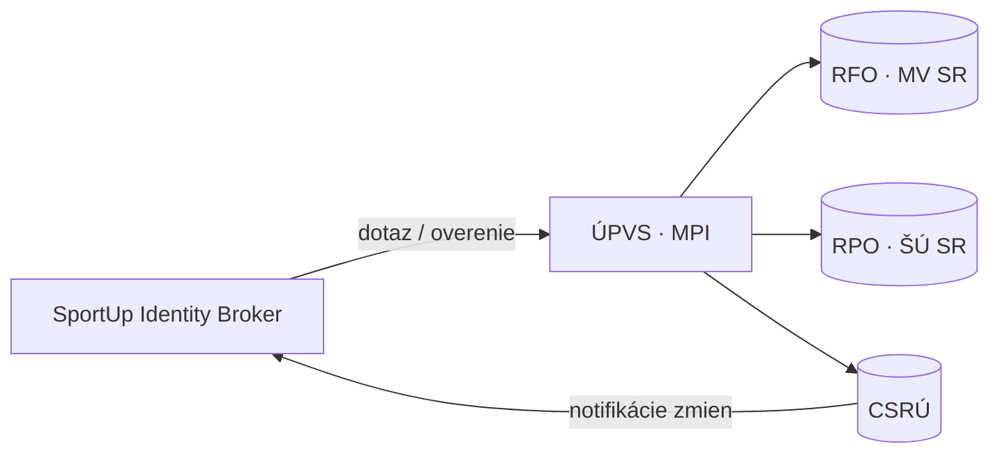
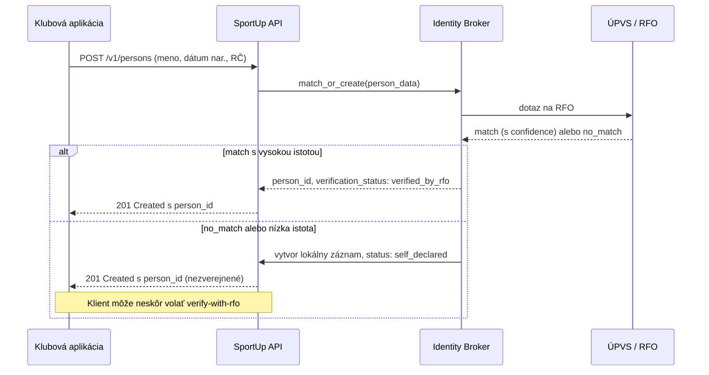
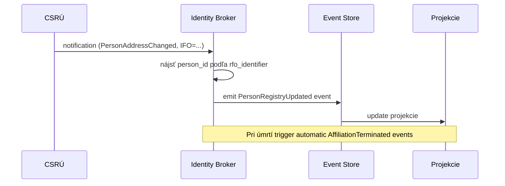

# Integrácia so štátnymi registrami (RFO, RPO)

> SportUp.sk je novej generácie IS športu, ktorý sa **nespoliehia na vlastnú evidenciu identity**. Identita fyzických osôb sa preberá z RFO, právnických z RPO, prepojenie je cez **ÚPVS** (slovensko.sk) a CSRÚ (centrálny systém referenčných údajov).

## Prehľad



## Zákonný rámec

| Zákon | Význam |
|---|---|
| Zákon č. 305/2013 Z.z. (eGovernment) | Právny základ pre referenčné údaje |
| Zákon č. 253/1998 Z.z. (RFO) | Register fyzických osôb |
| Zákon č. 272/2015 Z.z. (RPO) | Register právnických osôb |
| Zákon č. 18/2018 Z.z. (OOÚ) | Ochrana osobných údajov |
| Zákon č. 440/2015 Z.z. (šport) | Pôsobnosť MCRŠ a evidencia v športe |

**Pre nasadenie SportUp** je nutné, aby zákon o športe explicitne uznal SportUp ako oprávneného konzumenta referenčných údajov RFO/RPO. Toto je legislatívna úloha, nie len technická.

## Identity Broker

Samostatný service medzi jadrom SportUp a ÚPVS. Zodpovednosti:

1. **Match-or-create** pri novej Person — pokus o nájdenie zhody v RFO
2. **Mapovanie** internal `person_id` (UUID) ↔ `IFO` (RFO identifikátor)
3. **Synchronizácia cache** — atribúty z RFO/RPO sa udržiavajú lokálne
4. **Spracovanie notifikácií** z CSRÚ — zmeny adries, mien, úmrtí
5. **Auditovanie** — každý dotaz do RFO/RPO je logovaný (zákonná povinnosť)
6. **Rate limiting** podľa kvót dohodnutých s ÚPVS
7. **Resilience** — pri výpadku ÚPVS sa používa cached data so zníženou dôverou

## Workflow: registrácia novej osoby



## Workflow: notifikácia zmien



## Reagujeme na zmeny

| CSRÚ event | Reakcia v SportUp |
|---|---|
| Zmena mena | Pridať záznam do `PERSON_NAME_HISTORY`, aktualizovať cache |
| Zmena adresy | Aktualizovať cache (osobitný scope) |
| Úmrtie | `PersonDeceased` event → kaskádne `AffiliationTerminated` |
| Zmena štátnej príslušnosti | Aktualizovať cache, môže ovplyvniť reprezentáciu |
| Vznik PO (RPO) | Voliteľne pre-register Organization (ak má SportUp záujem) |
| Zmena štatutára | Aktualizovať cache, audit log |
| Zánik PO | Status `dissolved`, kaskádne `AffiliationTerminated` pre afiliácie |

## Bezpečnosť integrácie

- **Klientský certifikát** štátu (eID pre service account)
- **mTLS** medzi Identity Broker a ÚPVS
- **Audit** každého dotazu — kto, kedy, prečo (purpose), výsledok
- **Šifrovanie** RFO identifikátorov v lokálnej DB (KMS)
- **Žiadne proxying** — broker nesmie byť otvorený endpoint, iba ho volá interne SportUp jadro

## Rate limiting a kvóty

| Operácia | Typický limit |
|---|---|
| Match-or-create dotaz | 10 / sekundu na app |
| Bulk notifikácia z CSRÚ | unlimited (push do nás) |
| Pre-fetch (pri batch import) | 1000 / hodinu, dohodnúť |
| Verify-with-rfo na požiadanie | 60 / minútu na app |

Konkrétne kvóty sa dohadnú v zmluve s ÚPVS pri certifikácii.

## Cudzinci (bez RFO)

Pre osoby bez RFO záznamu (cudzinci, dlhodobí návštevníci):

- Identity Broker nevolá RFO (vie podľa krajiny)
- Vytvorí sa lokálny záznam s `verification_status: self_declared`
- Identifikátor cez `foreign_id_*` polia
- Pri získaní RFO záznamu (napr. udelenie pobytu) sa vykoná **manuálny merge** cez Identity Resolution

## Decommissioning existujúceho ISŠ

Postupný prechod, nie veľký bang:

```
Fáza 1 — Foundation
  • Identity Broker nasadený, certifikácia voči ÚPVS
  • Person endpoint funguje paralelne s existujúcim ISŠ
  • Existujúce dáta z ISŠ sa importujú ako "self_declared"

Fáza 2 — Domain core
  • Affiliation, Organization API
  • Pre nové registrácie sa už používa SportUp
  • ISŠ je "read-only" pre staré dáta

Fáza 3-5 — postupný presun ostatných agend
Fáza 6 — vypnutie ISŠ
```

## Nezávislé fázy testovania

- **Sandbox ÚPVS** pre integračné testy (ÚPVS poskytuje testovaciu inštanciu)
- **Tieňový režim** — produkčné volania sa zrkadlia do sandbox-u na overenie
- **Staged rollout** — najprv 1 zväz, potom skupina, nakoniec všetci

## Otvorené otázky

Tieto veci treba vyjasniť pred fázou 1 implementácie:

- Bude SportUp fungovať ako "OVM" (orgán verejnej moci) podľa zákona o eGovernmente, alebo cez špeciálne ustanovenie zákona o športe?
- Akým spôsobom MCRŠ deleguje prevádzkovateľstvo SportUp (poverená organizácia, ministerstvo priamo, novovznikajúca agentúra)?
- Aký je SLA s ÚPVS pre real-time integráciu?
- Aké sú nákladové implikácie volaní RFO/RPO (per-call fee?)
- Aké sú podmienky retencie dát po decommissioningu ISŠ?

## Referencie

- [`../architecture/identity-broker.md`](../architecture/identity-broker.md)
- [`../domain/entities/person.md`](../domain/entities/person.md)
- [Architektúra integrovaného IS verejnej správy SR](https://www.slovensko.sk)
- ADR-0001 — Event sourcing
